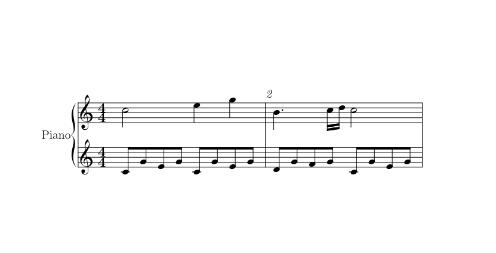

# Print Midi
:toc:


## Background

## Feature


## view transition

image::images/view_transition.svg[]


## View
[options="autowidth"]
|===
| name | feature | remarks

| Splash Screen | image | assets/splash.png
| Powered by React Native | image | auto
| main | main menu | 
| open file | - | system api
| set file name| - | system api
| permission | - | system api
| keyboard | kbdheader +
 pkeyboard +
 note frame
 frame |
| track & tone | set/select track/tone | 
| loading... | progress |
|score | TODO | 
| recording | TODO |
|===

### Splash Screen
Show Logo

### Powered by React Native
Show RN image

### main

has <<mainmenu,main menu>>

If permission for access rights has not been obtained, +
show <<permission, permission>>

### open file

system api

- select existing midi file

### set file name

system api

- select output file name

[[permission]]
### permission

system api

Pop-up to obtain access rights below

- Shared directory access
- Bluetooth access

### keyboard
show following parts

- kbdheader
- pkeyboard
- note frame

### track & tone

- select current track
- select tone of track
- select output synthesizer

maximum track number is [.red]#16#

### loading…

- show progress bar
- has cancel button

### score

show full score

### recording

- record button
- stop button
- select input source


## ViewParts

[options="autowidth"]
|===
|name | feature | remarks

| mainmenu | normal button |
| kbdheader | play/stop +
track +
put/erase +
resolution | 
| pkeyboard | black/white | 
| note frame |  | 
|===

[[mainmenu]]
### main menu

- Edit
- New Music
- Output PDF
- Show Score
- Recording
- License

## data

### MidiProps

All data needed to edit midi

|===
| name | type | details | remarks

| delta | tempo | |
| trackdata | TrackData[] | full score |
|===

### StatusProps
Data required only while the app is running

|===
| name | type | details | remarks

| trackno | number | current track(channel) | 
| measure | number | current measure | 
| play mode | boolean | play or stop |
| edit mode | boolean | write or erase |
|===

### TrackData

|===
| name | type | details | remarks

| bars | Bar[] | All measure data of a certain instrument | 
|===

### KeyboradScreenProps

Data required to edit on the keyboard screen

|===
| name | type | details | remarks

| status | StatusProps |  |
| bar | Bar | A collection of mtrk event data divided by measure | 
|===

### Bar

|===
| name | type | details | remarks

| events | MidiEvent[] | mtrk events par measure | 
|===

#### MidiEvent


|===
| name | type | details | remarks

| delta | number | position | 
| kind | number | include parameter |  such as 9b 41 4e +
(note on 65:F(Fa) ch:11 vol:midium)
|===

## ShowScore


[musixtex]

Generate a pdf from a tex file using pdflatex and musixtex and display it on the screen

Therefore,  a tex file will be needed to generate first.
For example, the generated tex file is as follows.

```tex
\documentclass[a4paper,12pt]{article}
\usepackage{musixtex}

\begin{document}
    \begin{music}


\parindent10mm
\instrumentnumber{1} % a single instrument
\setname1{Piano} % whose name is Piano
\setstaffs1{2} % with two staffs
\generalmeter{\meterfrac44}% 4/4 meter chosen
\startextract % starting real score
\Notes\ibu0f0\qb0{cge}\tbu0\qb0g|\hl j\en
\Notes\ibu0f0\qb0{cge}\tbu0\qb0g|\ql l\sk\ql n\en
\bar
\Notes\ibu0f0\qb0{dgf}|\qlp i\en
\notes\tbu0\qb0g|\ibbl1j3\qb1j\tbl1\qb1k\en
\Notes\ibu0f0\qb0{cge}\tbu0\qb0g|\hl j\en
\endextract % terminate excerpt
\end{music}
\end{document}
```

.Image of generated pdf


### TeX

the following items running on iOS are required to convert from tex to pdf.

- pdflatex
- musixtex
- font for musixtex

pdflatex is to use the following.

https://github.com/holzschu/lib-tex

musixtex and font are platform-independent text files, so download and deploy the one of any platform.